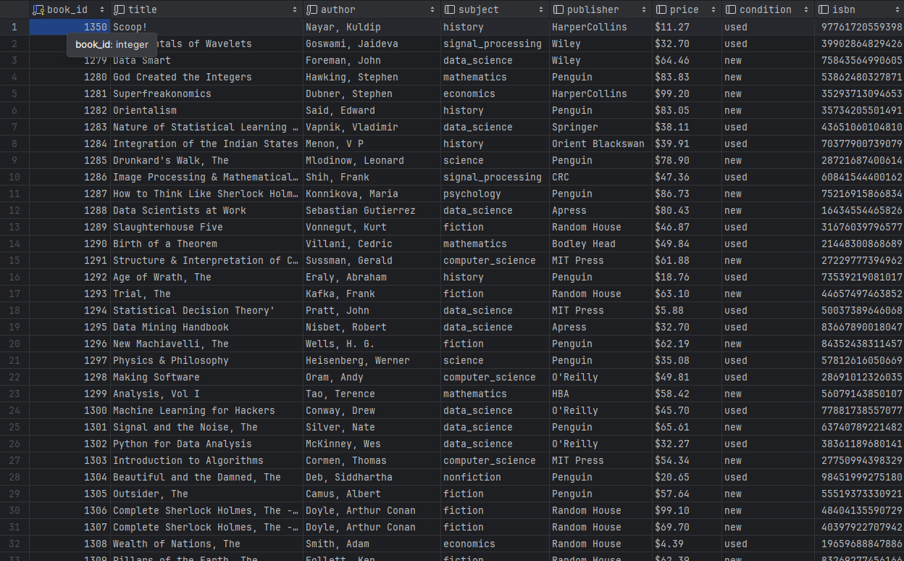

<h1>Online Bookstore</h1>
<h3>The objective of this project is to develop an e-commerce platform for books that will enable users to search for their desired books, place orders, and receive an email containing a file that will work as a placeholder for an eBook. </h3>
<h2>Current WIP</h2>
<h3> The Programs capabilities currenlty only allow for users to search for books in the database based on ISBN numbers</h3>
<h3>The functionality can be accessed through the query.ipynb</h3>
<h2>Book Data</h2>

<h2>Technologies and Tools</h2>
<h3>Eventually this program will be use django as a user interface</h3>
h3>The database will be written in postgres</h3>
<h3>The functions will be written in python</h3>
